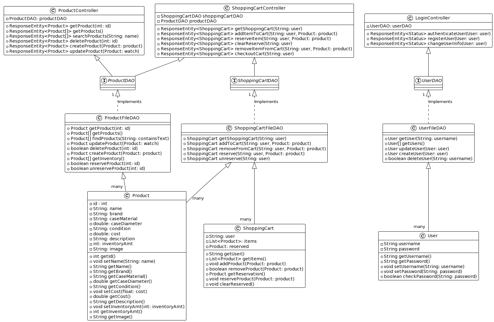

# Fibonacci Store Design Documentation

## Team Information
* Team name: Team-04
* Team members
  * Aparnaa Senthilnathan
  * Bishop Oparaugo
  * Luke Wyland
  * Nate Mount
  * Richard Wituszynski

## Executive Summary

This is a summary of the project.
Working in groups of 4-5 team members, students will learn to adapt in a software team environment making use of the tools and learning the SWEN concepts integrated in the formation, success, efficiency of team projects in real-world. Using your knowledge of the REST-API, Angular tutorial, and basic fundamentals, students are to actively participate and contribute towards the progression of tasks required of them. As a final project team members will be tested on their knowledge and implementation of such concepts and apply them towards the development of their final e-store api project. Each group will be assigned specific mvp user requirements that are expected to be complete and fully demo tested in the latter two sprints. Finally, post-sprint 4 will entail each group presenting the design of their e-store and team/individual reflections during the development of the project.

### Purpose

The purpose of this project is to collaborate within a team workspace environment. By using our knowledge of SWEN and its concepts to create an e-store that satisfies any and all requirements provided by the User/Product Owner towards the completion of the final project they envisioned. While also working to incorporate interactive UI elements and unique features that promote user attraction to our platform.

User Group Goals:

1. Maintain user activity
2. Provide user with an easy and convenient shopping experience
3. Incorporate fun interactive features for users to engage with
4. Work towards completing all user stories required of us
5. Form the habit of testing each e-store feature to avoid system crashes
6. Have a fully functioning e-store
7. Actively communicate with other members in the group
8. Voice out your opinions at discussions
9. Lean on the support and expertise of other members

### Glossary and Acronyms

| Term | Definition |
|------|------------|
| SPA | Single Page Application|
| NPM | Node Package Manager|
| POM | Project Object Model|
| JSON | Javascript Object Notation|
| Rest-Api | Restful Application Programming Interface|
| HTML | HyperText Markup Language|
| CSS | Cascading Style Sheets|
| MVP | Minimum Viable Product|
| Carousel | Bootstrap Element for Displaying products on a rotating display with the product image and name. |
| Route | An Angular method for routing the user to a specific page/component. |
| Routing Guards | An Angular Routing element that prevents users from accessing certain route(s). |
| Rest-Api | A software architectural style that describes the interface shared between two computer systems in the secure exchange of information.|
| Angular | This is a platform and framework for building single-page client applications using HTMl, Css, and Typescript.|
| Maven | Software tool used for building projects, developing reports, checking application builds, and testing automation setups.|

## Requirements

This section describes the features of the application.

- Authentication
  - User and Admin credentials validated with backend server.
  - Users are able to register with new credentials for future login.
  - User are prevented from accessing "inventory management" page.
  - Admin is prevented from accessing users carts.
  - Logged in Users and Admins are unable to register for a new account.
  - User and Admin are notified if login credentials are wrong.
  - Users are notified if the given username already exists.
  - Routing Guards preventing access to other user carts.
- Inventory System
  - Admin can add new items to products.
  - Admin can delete pre-existing products.
  - Admin can modify pre-existing products.
  - When modifying inventory amount, cost, and case diameter. Type checking takes place to ensure the right data type is entered.
- Shopping Cart
  - Users shopping carts persist while logged out and logged in.
  - Users can continue to checkout.
  - Users can add and remove items from there shopping cart.
- User Functionality
  - List of products are displayed to both the Users and the Admin.
  - Products are displayed on homepage via a "Carousel" to display products in inventory.
  - Users are able to search for products.
  - Users can select a product for additional information.
- Data Persistence
  - User's carts save while logged in and logged out for future purchase.
  - User login information is saved for future logins.
  - Product information saves after modification.
- Item Reservation
  - User can select to reserve an item to ensure the item is saved for future purchase.
  - The user can unreserve an item to put the item back into inventory.

### Definition of MVP

A minimum viable product (MVP) is a technique implemented in agile teams to stress the impact of learning during the development of a new product. It is the early version of a product with enough features to be usable by early customers who can provide feedback for future product development.

### MVP Features

- **As** a user/admin **I want** to be able to login via a UI **so that** I can easily manage my account.
- **As** a user **I want** to register **so that** I can save my stuff to my account and come back to the store at a later time.
- **As** a developer **I want** to submit a request to get the entire inventory **so that** I have access to all of the products.
- **As** a developer **I want** to submit a request to get the products in the inventory whose name contains the given text **so that** I have access to only those products.
- **As** a developer **I want** to submit a request to get a single product **so that** I can access the price and quantity.
- **As** a developer **I want** to submit a request to get the entire inventory **so that** I have access to all products and their details.
- **As** a developer **I want** to submit a request to create a new product (name, price, quantity) **so that** it is available to in the inventory.
- **As** a developer **I want** to submit a request to delete a single product **so that** it is no longer in the inventory.
- **As** a buyer **I want** to be able to add products to my shopping cart **so that** I can put together an order for purchasing.
- **As** a buyer **I want** to be able to remove products to my shopping cart **so that** I can get rid of items I don't want to purchase.
- **As** a user **I want** to take my items to checkout **so that** I can buy them.
- **As** a developer **I want** to use functions **so that** I can interact with long term storage.
- **As** a buyer **I want** to have a shopping cart that persists **in order to** have a place to keep products I’m considering for purchase.
- **As** a user **I want** to reserve items **so that** I can purchase them later.

### Roadmap of Enhancements

1. Improved Navigation bar that has better accessability by being keyboard-accessible.
2. Improved display of product organization.
3. Improved cart menu that matches other UI elements on the store.
4. New Search element on Navigation Bar that redirects to a page of the searched products rather than displaying the searched products in a list on the search bar.
5. Carousel on homepage displays random products from the store. 
6. Submit button that instantly directs the user to the home page after user verification. 

## Application Domain

The most important domain entities of our online store are the user, admin, inventory, and shopping cart. The user is able to browse a page of products that are retrieved from the inventory system. The administrator account, with reserved username 'admin', is able to edit/create/delete new products in the inventory system. A user is able to add items to their cart, and within their cart, they are able to select one item to reserve. The difference between adding an item to the shopping cart and reserving an item is, that reserving an item reduced the amount of available inventory. For example, if there is a small amount of a product left, a user can reserve that item, decrementing the amount of that product available so that other users are not able to check that item out. When a user is ready to check out, their items will be purchased, and the amount of inventory for the products purchased will be reduced. If an item is out of stock at the time of purchase, that item will not be checked out, and will simply remain in the shopping cart. If a user logs out, their shopping cart and reserved item will be saved.

## Architecture and Design

The three main pages we have in our website are Home, Products, and Login. Additional pages such as Shopping Cart will appear depending on what you logged in to the website as.

These pages are formatted through HTML and many of the headers in every page are centered to better organize the page. Bootstrap elements from Angular are also added as visual elements that make our e-store pop.

### Summary

The following Tiers/Layers model shows a high-level view of the webapp's architecture.

The e-store web application, is built using the Model–View–ViewModel (MVVM) architecture pattern. 

The Model stores the application data objects including any functionality to provide persistance. 

The View is the client-side SPA built with Angular utilizing HTML, CSS and TypeScript. The ViewModel provides RESTful APIs to the client (View) as well as any logic required to manipulate the data objects from the Model.

Both the ViewModel and Model are built using Java and Spring Framework. Details of the components within these tiers are supplied below.

### Overview of User Interface

This section describes the web interface flow; this is how the user views and interacts
with the e-store application.

- Signup
  - User is taken to a signup portal where they can input a username and password.
  - Once user fills textbox and clicks the button, a new account will been created.
- Login
  - User enters credentials from Signup.
  - Once the User clicks the Submit button, they are directed to the homepage of the e-store.
- Home
  - User sees a dashboard of popular products on a carousel, User authorized pages at the NavBar in a cool minted green background.
  - Can click on the navbar pages, search bar, highlighted products, etc.
  - Easily navigate around the e-store.
  - On the top right side of the page, The user can see their account username is logged in.
- Search Functionality
  - User can search for any and all products available in the store.
  - Search feature provides an lower box template with possible searches from the characters in search string (All Clickable).
- Products Page
  - User can scroll down to the last product.
  - User can see the images of all products to get an idea of what they are buying.
  - User can click on all products and view more details about each product.
  - User can add an item to the shopping cart for purchase.
- Cart
  - User can add/remove an item(s) to the cart.
  - User can click to reserve/unreserve an item in the cart.
  - User can logout and login with items still saved in the cart.
  - User can checkout items.
  
### View Tier

The User Application was composed of multiple views built using Angular Components. The following list includes all Angular components and the functionality of the given component.

- App Component
  - Used to handle all global settings.
- Navigation
  - Navigation (Component)
    - Used to format and display the Navigation bar on all pages. This component also handles determining if certain hyper links are displayed to the user in order to navigate to certain pages.
- Home
  - Home (Component)
    - The Home page to the website, containing a Bootstrap Carrousel from the ngx-bootstrap package the displays the first five items from the product.JSON, and a search box for the user.
- Cart
  - Cart (Component)
    - Used to display the cart of given users items. Along with buttons to reserve, un-reserve, and delete items from the cart.
  - Shopping Cart (Service)
    - Contains all Angular Services related to accessing information for the user's cart. Including getting all items, adding an item to the cart, deleting an item from the cart, reserving and, un-reserving items from the cart.
  - Cart Guard
    - Used to prevent user access to other peoples carts and the cart page if the user is not logged in.
- Management
  - Management (Component)
    - Displays the Inventory management system to the Admin. More specifically this page displays a list of all the products that the admin is able to select and edit the product information via the "product-detail" component. This page is only accessible to the admin login.  
  - Management Guard
    - Used to prevent un-logged in users accessing the page. It also ensures the user is logged in as an admin before they are able to access the page.
- Login
  - Login (Component)
    - The login page for the User. Built using Angular forms for processing user input and form validation. Tooltips from ngx-bootstrap are used to provide the user feedback regarding the result of their inputs.
  - Login (Service)
    - Handles User login HTTP requests to Authenticate the user and ensuring their credentials are right.
- Signup
  - Signup (Component)
    - Displays the signup page to the user so they are can register for an account. The use of Angular forms were used to check for a valid input and tooltips from ngx-bootstrap were used to provide the user instant feedback regarding their input. Once entered, the user can confirm their entry and are routed away upon success or notified what the problem was with their information if unable to signup. 
  - Signup (Service)
    - Handles the HTTP request to the backend for ensuring the entered user information is valid.
  - Signup Guard
    - Used to ensure an already logged in user isn't able to create a new account.
- Products
  - Products (Component)
    - Handles displaying all of the products to the user.
  - Products (Service)
    - Contains all of the HTTP requests related to products. These requests include getting all products, getting one products based on ID, searching the products, adding a product, deleting a product, and updating a product.
- Product-search
  - Product-search (Component)
    - Allows the user to search for a given product based on if the entered text is contained within the product name.
- Product-detail
  - Product-detail (Component)
    - Used to edit the information of a given product. Angular forms are used to take the user input and ensure the information entered is valid and of the correct type to avoid creating exceptions in the REST API backend. Once all information is valid the user is able to hit confirm and their changes take effect.
- page-not-found
  - page-not-found (Component)
     - Used for displaying an error page in the event a user attempts to route to a page they are able to access or a page that does not exist.
- Messages
  - Messages (Component)
    - Used to display HTTP messages made to the backend for easier development.
  - Messages (Service)
    - Adds messages to the component to ensure the list of messages is retained globally for all pages with the component.

The following sequence diagram shows the process in order for a user to sign in to the E-store.

As seen in the following diagram, the user first enters their password and username. Then the user confirms their entered information by pushing the sign in button. At this point the Login component processes their request for logging, calling the login service in the process to authenticate the user. This then makes a call to the REST API that then retrieves the users login information and checks if it is valid. Based on if the user's login was valid, a nonexistent username, or an invalid password. Either it routes to the homepage in the case of a valid login or displays a tooltip with the given feedback.

The following sequence diagram shows the process of adding an item to the cart.

The following diagram shows how the user could access a product in inventory then based on if it was available the user would be able to see it. The user could also add the given product to their cart of which would get the item from the inventory and then add it to the given user's cart. It would then display the item in the user's cart.

### ViewModel Tier

The following image shows the class diagram for the entire backend of the E-store.

For each different JSON file that required persistence of data their was both the Data Aces Object and the class that implemented the interface. Depending on the controller they each need to access a specific DAO in order to make changes to the JSON files for the User information, Shopping Carts, and the Products. Along with this there were also three data objects to represent the Users, Shopping Carts, and a Product.

### Model Tier

This Tier Consists Of
  - Product Components
  - User Components
  - Shopping Cart Components

#### Product Components
Components
  - Product
    - contains all information pertaining to one product
    - contains all functions needed to interact with and modify the product
  - Product File DAO
    - Contains all functions used for managing, creating, and accessing products
  - Product DAO
  - Product Controller

#### User Components

Components
  - User
    - Contains all information pertaining to a single user
    - Contains all functions pertaining to the user
      - Password checker and setter
      - Username checker and setter
  - User File DAO
    - Contains all functions required for accessing, interacting with and building a user
  - User DAO
    - Outline for the User File DAO
  - Login Controller
    - Manages web requests that are related to a user
    - Manages user login and registration

#### Shopping Cart Components
Components
  - Shopping Cart
  - Shopping Cart DAO
  - Shopping Cart File DAO
  - Shopping Cart Controller

### Static Code Analysis/Design Improvements

The following image shows the flags returned by SonarQube.

When we used the software SonarQube to scan our program for errors, we founded two flags. One flag is from the Product.java file and the other is from the ShoppingCart.java file. Both of these flags had the same message, which is that both classes overrode "equals()" and should therefore also override "hashCode()".

## Testing
This section will provide information about the testing performed and the results of the testing.

### Acceptance Testing

Throughout the four sprints, we wrote many user stories and epics on our Trello board that guided us towards developing our e-store. We have a total of 

In the end, we have thirty-three user stories that passed all of their acceptance criteria tests and four user stories that have not had any testing yet. We don't have any user stories that had at least failed one acceptance criteria test. 

### Unit Testing and Code Coverage

Our main unit testing strategy was to split our tests into sections based on what file the program will test. The UI portions of our website were one test program. As for the back-end, we split that testing program into three sections that mirror the sections (model, controller, persistence). That way, it was easier for each of us to test only on what code we modified so that there weren't any errors that don't belong to our code.

Our overall code coverage was exactly 90.0%. Our main coverage target was to hit at least 90.0%, which we did. We chose this percentage threshold because this shows that most of our code is verified and that our program is ready to be published.
